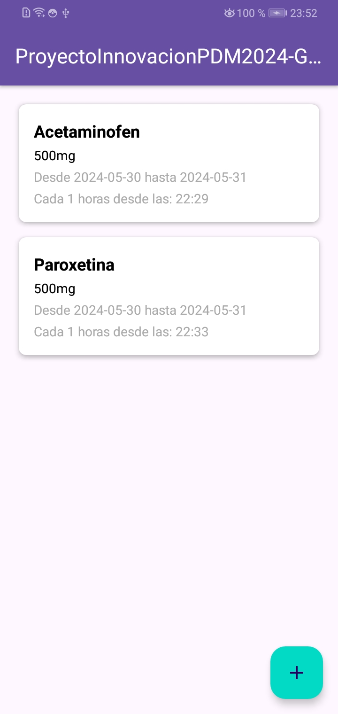
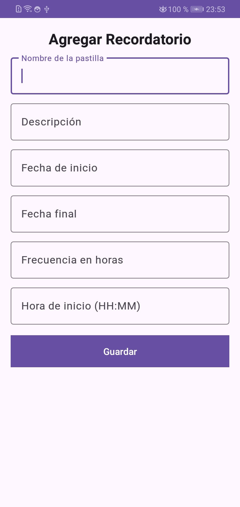
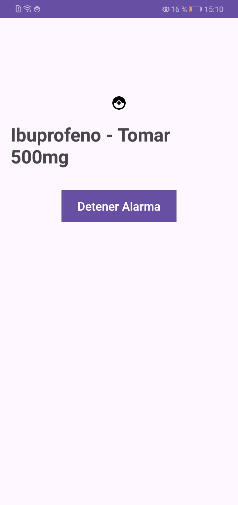
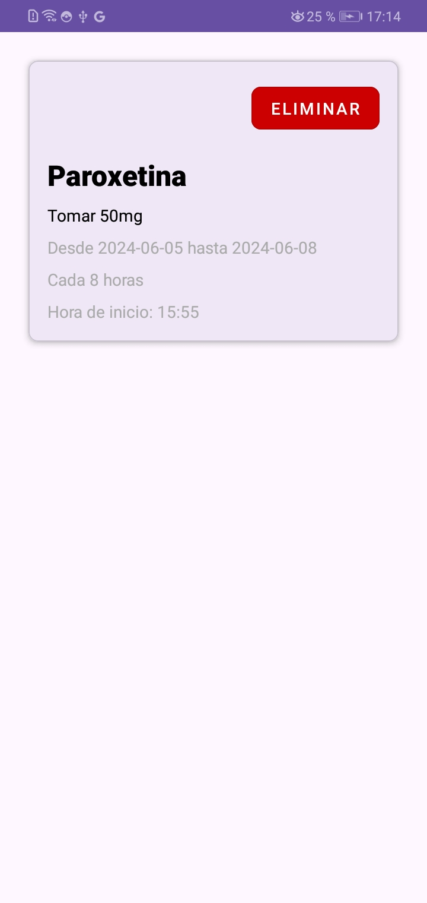
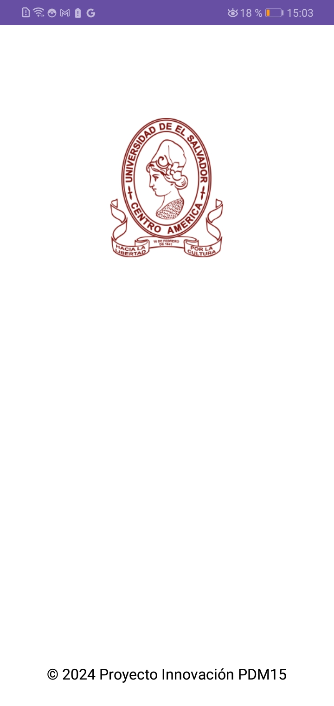

# ProyectoInnovacionPDM2024-GT01-Grupo3
Proyecto de Innovacioncorrespondiente a la Asignatura de Programacion de Dispositivos Moviles

# 💊 Recordatorio de Medicamentos

## Descripción

**Recordatorio de Medicamentos** es una aplicación para Android diseñada para ayudarte a gestionar tus tomas de medicamentos de manera eficiente y sin estrés. Puedes crear recordatorios personalizados para cada pastilla, especificando la fecha de inicio y final, la frecuencia en horas y la hora de inicio. Además, permite agregar descripciones detalladas para cada recordatorio, brindando una mayor personalización.

### Objetivo

La aplicación está dirigida a personas que necesitan tomar múltiples pastillas al día o a quienes cuidan de personas con esta necesidad. Con esta herramienta, se reduce la preocupación por olvidar una toma y se mejora la organización diaria, proporcionando facilidad y tranquilidad al usuario.

## Características

- 📅 **Programación de Recordatorios**: Establece la fecha de inicio y final de la toma de medicamentos.
- ⏰ **Frecuencia y Hora de Inicio**: Define la frecuencia de los recordatorios en horas y la hora específica de inicio.
- 📝 **Personalización**: Añade descripciones detalladas para cada recordatorio.
- 🔔 **Notificaciones**: Recibe alertas oportunas para cada toma de medicamento.
- 🎨 **Interfaz Moderna**: Utiliza Material Design para una experiencia de usuario intuitiva y atractiva.

## Tecnologías Utilizadas

-  **Kotlin**
-  **Android**
-  **SQLite**

## Librerías Utilizadas

- 🛎️ **NotificationManager**: Gestión de notificaciones para alertas.
- 📑 **RecyclerView**: Visualización eficiente de listas de recordatorios.
- ⏲️ **Alarm Manager**: Programación precisa de alarmas.
- 🎶 **Android Media Player**: Reproducción de sonidos para alertas.
- 🖌️ **Material Designer**: Implementación de componentes de Material Design.
- 😃 **Toasty**: Notificaciones personalizadas con estilos y animaciones.

## Capturas de Pantalla

<table>
  <tr>
    <td></td>
    <td></td>
    <td></td>
    <td></td>
    <td></td>
  </tr>
</table>

